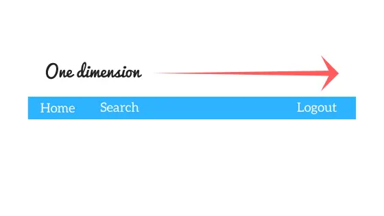
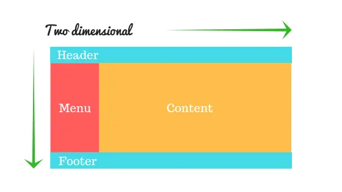
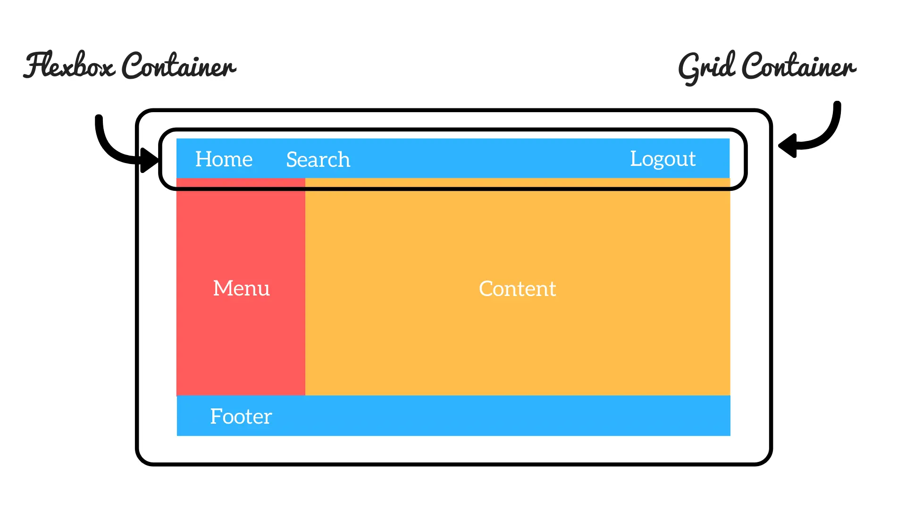
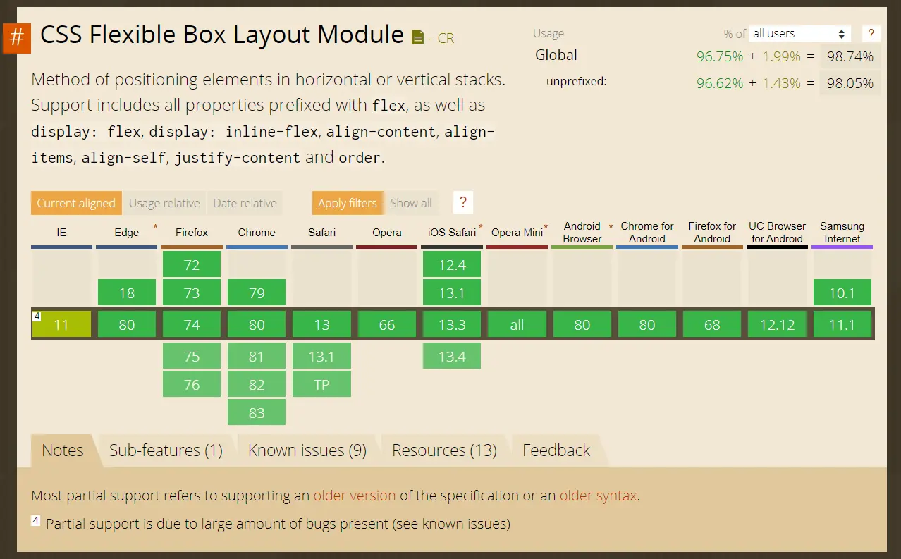
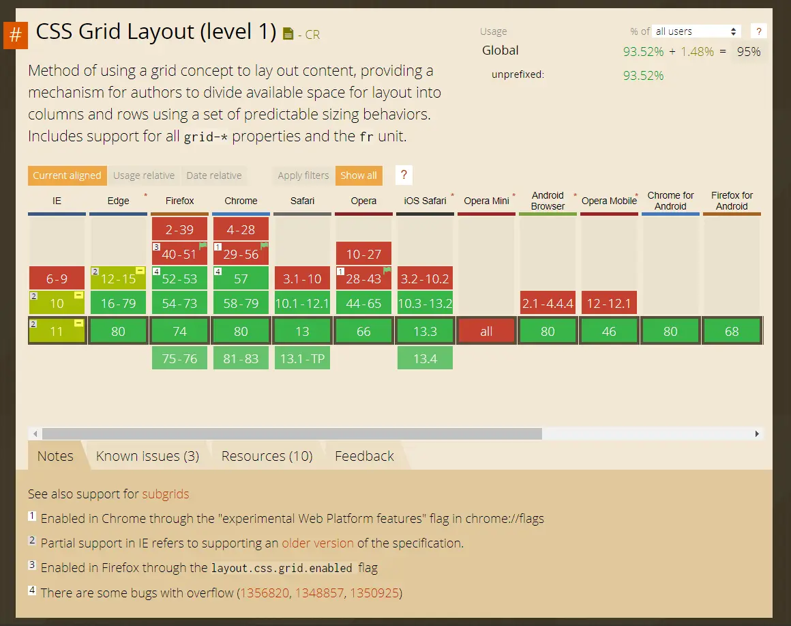

Everything you browse on the internet is contained in web pages. Those web pages accommodate content and that content needs a layout to fit itself in it. Nowadays, the technology has enabled us to browse the web on any screen dimension we wish for and your content should be responsive to any dimension we put forward. That’s where responsive layout design knocks the door.

CSS has always been used to design the layout and looking of web pages but producing complicated multi-column layouts has always been fiddly and hackish, and frustrating to get working consistently and precisely across browsers as well. First, we used tables, floats, positioning and inline-block, but all of these techniques left out a lot of major functionality (vertical centering, for example).

To solve these layout complications, we invented proper responsive layout models available natively in the browser, out of which - Flexbox, CSS Grid and Bootstrap became most popular and are widely supported across all platforms & browsers. These not only equipped us to create layouts that previously wasn’t feasible to create without involving JavaScript, but these also make code easier to understand and maintain.

Here, I will precisely talk about Flexbox & CSS Grid fundamentals and when to choose what model layout. I will write about each layout model in upcoming posts, but here I am pushing out their terminologies and properties for the sake of brevity.

> Want to dive into them right now? Well, you’re in luck! I have added some resources for further reading about them at the end of the article.

## Flexbox Fundamentals

The Flexbox (Flexible Box) Layout model emphasize at presenting a more methodological way to lay out, align and allocate space among items in a container, even when their size is unknown and/or dynamic (thus the word “flex”).

> “The main idea behind the flex layout is to give the container the ability to alter its items’ width/height (and order) to best fill the available space (mostly to accommodate to all kind of display devices and screen sizes).”

> — [Chris Coyier](https://chriscoyier.net/)

  
    
One-dimensional approach of Flexbox

A flex container expands its items to fill available free space or shrinks them to prevent overflow. It provides a better arrangement of all of the page elements. It is a **one-dimensional** layout model that offers space allocation between items in an interface and robust alignment capabilities.

## CSS Grid Fundamentals

CSS Grid Layout is a CSS layout method developed for the **two-dimensional** layout of items on a webpage or an application, meaning it can manage both columns and rows.

> CSS Grid outshines at dividing a page into several sections or defining the correlation in terms of size, position, and layer.

Like tables, grid layout allows us to align components into columns and rows. However, numerous layouts are either achievable or easier with CSS grid than they were with tables. For example, a grid container’s children could place themselves so they truly overlap and layer, alike CSS positioned elements.

  
    
Two-dimensional approach of CSS Grid

## CSS Grid vs Flexbox

1. CSS Grid Layout is a two-dimensional system, meaning it can handle both columns and rows, unlike flexbox which is largely a one-dimensional system (either in a column or a row).

2. A core difference between CSS Grid and Flexbox is that — CSS Grid’s approach is layout-first while Flexbox’ approach is content-first.
*If you are well aware of your content before making layout, then blindly opt for Flexbox and if not, opt for CSS Grid.*

3. Flexbox layout is most appropriate to the components of an application (as most of them are fundamentally linear), and small-scale layouts, while the Grid layout is intended for larger scale layouts which aren’t linear in their design.
4. If you only need to define a layout as a row or a column, then you probably need flexbox. If you want to define a grid and fit content into it in two dimensions — you need the grid.

> Tip:
You can even combine these layout models. Note that you can use a Flexbox container inside a CSS Grid container but you cannot implement it vice-versa. See image below for a visual perspective.

  
  
Flexbox Container inside a Grid Container

I also made a [presentation](https://app.ludus.one/634ef6b9-4ed2-420d-b24f-333574e625f2) on CSS Grid vs Flexbox on Ludus. Check it out.

<iframe src="https://app.ludus.one/634ef6b9-4ed2-420d-b24f-333574e625f2/full?controls=always" frameborder="0" allowfullscreen style="position:absolute;top:0;left:0;width:100%;height:100%;"></iframe>

## Browser Support & Bugs

Most modern web browsers now support both CSS Grid and Flexbox. The images below show detailed analysis of browser support for Grid & Flexbox.

  
  
CSS Flexbox Browser Support. (<a href="https://caniuse.com/#feat=flexbox">Source</a>)

  
  
CSS Grid Layout Browser Support. (<a href="https://caniuse.com/#feat=css-grid">Source</a>)

Still, if you want your content to be consistent across all browsers, you may consider writing some more lines of CSS with help of following articles for each of layout model.

- [Using Flexbox: Mixing Old and New for the Best Browser Support](https://css-tricks.com/using-flexbox/)
- [Advanced Cross-Browser Flexbox](https://dev.opera.com/articles/advanced-cross-browser-flexbox/#fallbacks)
- [Browser Compatibility for CSS Grid Layouts with Simple Sass Mixins](https://css-tricks.com/browser-compatibility-css-grid-layouts-simple-sass-mixins/)
- [Using CSS Grid: Supporting Browsers Without Grid](https://www.smashingmagazine.com/2017/11/css-grid-supporting-browsers-without-grid/)

### Bugs & Issues

- [GridBugs by Rachel Andrew](https://github.com/rachelandrew/gridbugs)
- [FlexBugs by Philip Walton](https://github.com/philipwalton/flexbugs)

## Hey, what about Bootstrap?

I am not covering [Bootstrap](https://getbootstrap.com/) and its fundamentals here but below is a [helpful article](https://hackernoon.com/how-css-grid-beats-bootstrap-85d5881cf163) for you to read if you’re interested.

## Resources for further reading

- Videos Tutorials
    1. [What The Flexbox?! by Wes Bos](https://flexbox.io/)
    2. [CSS Grid by Wes Bos](https://cssgrid.io/)

- Articles
    1. [A Complete Guide to Grid](https://css-tricks.com/snippets/css/complete-guide-grid/)
    2. [Grid by Example](https://gridbyexample.com/)
    3. [A Complete Guide to Flexbox](https://css-tricks.com/snippets/css/a-guide-to-flexbox/)
    4. [A Visual Guide to CSS3 Flexbox Properties](https://scotch.io/tutorials/a-visual-guide-to-css3-flexbox-properties)
    5. [Flexbox Froggy — A game for learning CSS flexbox](https://flexboxfroggy.com/)

---

This is my first post ever. Your each 👏 would motivate me to write more helpful articles and make open source contribution. You can further connect with me on LinkedIn, Instagram, GitHub, Twitter and Facebook.
